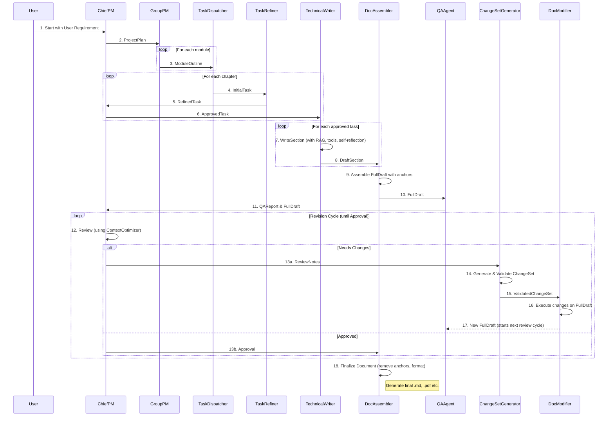

# 多智能体文档撰写系统 开发文档 v4.0
---

### **1.0 核心设计理念 (Core Design Philosophy)**

*(这部分内容从你最初的PRD中提炼，保持高层级和理念性)*

本SOP旨在构建一个**自进化、高鲁棒性、可度量**的自主文档生成系统。它模拟现实世界的高效组织，将复杂的智力劳动解构为**分层级、专业化**的协作。

*   **1.1. 核心架构**: 系统分为**决策层 (Strategy)**、**执行层 (Execution)** 和 **工具层 (Tooling)**。
    *   **决策层** (`ChiefPM`, `GroupPM`) 使用顶级LLM，负责“做什么”（What）。
    *   **执行层** (`TechnicalWriter`) 使用成本效益均衡的LLM，负责“怎么做”（How）。
    *   **工具层** (`DocModifier`, `DocAssembler`) 是非LLM的确定性角色，保证操作的精确性。

*   **1.2. 鲁棒的长文本修订**:
    *   **理念**: 杜绝让LLM直接编辑长文本。我们采用**“语义决策 -> 指令转换 -> 精确执行”**的三步法。
    *   **实现**: `ChiefPM`输出自然语言`ReviewNotes`，`ChangeSetGenerator`将其转换为基于**上下文锚点 (Context Anchors)** 的`ValidatedChangeSet`，最后由`DocModifier`精确执行。此流程通过**验证-修复循环**保证100%的执行可靠性。

*   **1.3. 双模态上下文管理**:
    *   **理念**: 区分处理**静态长文档**和**动态对话历史**。
    *   **实现**:
        *   **`ContextOptimizer`**: 对静态长文档进行**临时RAG压缩**，智能保留关键信息，避免上下文溢出。
        *   **`ConversationManager`**: 对动态对话历史进行**增量RAG管理**，实现高效、可扩展的长期记忆。

*   **1.4. Agent智能增强**:
    *   **自我修正**: 关键`Action`具备**行动后反思 (`_reflect`)**能力，提高首轮交付质量。
    *   **动态工具调用**: `TechnicalWriter`可自主调用`Web_Search`, `Diagram_Generator`等工具，扩展能力边界。
    *   **全面质量保障**: `QAAgent`进行自动化质检，`PerformanceMonitor`记录全流程性能数据，为持续优化提供数据支持。

---

### **2.0 团队角色与职责 (Team Roles & Responsibilities)**

*(这部分内容也来自你的PRD，是角色和其职责的高层描述)*

| 角色 (Role)          | 核心职责                               | 关键能力/配置                                  |
| -------------------- | -------------------------------------- | ---------------------------------------------- |
| **`ChiefPM`**        | 顶级规划、任务审批、最终审阅与决策     | 强逻辑推理 (GPT-4o), `ContextOptimizer`        |
| **`GroupPM`**        | 模块细化，生成包含`rag_hint`的详细大纲 | 探索式RAG, 结构化输出                          |
| **`TaskDispatcher`** | 快速将大纲转换为初步任务               | 快速、经济的LLM (GPT-3.5-Turbo)                |
| **`TaskRefiner`**    | 使用CoT精炼任务，补充细节与验收标准    | 思维链推理 (GPT-4o)                            |
| **`TechnicalWriter`**| 撰写章节内容                           | 动态RAG/工具决策, 自我反思, `ContextOptimizer` |
| **`QAAgent`**        | 自动化质检，生成QA报告                 | 事实/术语/风格校验                             |
| **`ChangeSetGenerator`**| 将自然语言笔记转换为`ValidatedChangeSet`| **验证-修复循环**, 上下文锚点定位            |
| **`DocAssembler`**   | **(非LLM)** 组装草稿与定稿              | 注入/移除锚点, 多格式转换                      |
| **`DocModifier`**    | **(非LLM)** 精确执行`ValidatedChangeSet`| 基于锚点的字符串操作                           |
| **`PerformanceMonitor`**| **(非LLM)** 静默记录性能数据            | 消息监听, 数据聚合                             |
| **`Archiver`**       | **(非LLM)** 归档项目产物与状态快照      | 文件I/O, MetaGPT序列化                         |

---

### **3.0 项目与代码结构 (Project & Code Structure)**

*(这是工程文档的开端，告诉工程师代码应该如何组织)*

```
metagpt-doc-writer/
├── configs/
│   └── config2.yaml             # 配置文件模板
├── data/
│   └── knowledge_base/          # RAG的原始文档 (e.g., metagpt_docs.md)
│   └── outputs/                 # 最终生成的文档
│   └── archive/                 # 归档的项目快照
├── metagpt_doc_writer/
│   ├── __init__.py
│   ├── actions/                   # 所有Action的定义
│   │   ├── __init__.py
│   │   ├── base_actions.py        # 可共享的基类或通用Action
│   │   ├── write_section.py
│   │   └── ...
│   ├── roles/                     # 所有Role的定义
│   │   ├── __init__.py
│   │   ├── chief_pm.py
│   │   └── ...
│   ├── schemas/                   # Pydantic数据结构定义
│   │   ├── __init__.py
│   │   └── doc_structures.py
│   ├── prompts/                   # Prompt模板
│   │   ├── __init__.py
│   │   └── writer_prompts.py
│   ├── tools/                     # <--- 新增: 集中管理所有可复用的工具
│   │   ├── __init__.py
│   │   ├── base_tool.py           # (可选) 定义所有工具的基类接口
│   │   ├── web_search.py
│   │   ├── diagram_generator.py
│   │   └── ...                    # 未来可以不断添加新的工具
│   └── utils/                     # 辅助工具和函数
│       ├── __init__.py
│       └── context_optimizer.py
├── tests/
│   ├── conftest.py                # Pytest配置文件和fixtures
│   ├── actions/
│   └── roles/
├── build_index.py                 # 构建RAG索引的脚本
└── run.py                         # 项目主入口
```

---

### **4.0 核心类与数据结构实现 (Core Class & Schema Implementation)**

*(这部分是核心的工程蓝图，详细定义了每个模块的“骨架”)*

#### **4.1. 数据结构 (`schemas/doc_structures.py`)**

所有跨Agent传递的结构化数据都必须在这里使用`pydantic.BaseModel`定义。

```python
# in metagpt_doc_writer/schemas/doc_structures.py
from pydantic import BaseModel, Field
from typing import List, Dict, Any

class ProjectPlan(BaseModel):
    modules: List[str] = Field(..., description="List of top-level module titles")

class FullDraft(BaseModel):
    content: str = Field(..., description="Full content with embedded anchor IDs")
    version: int = 1

class Change(BaseModel):
    operation: str = Field(..., description="e.g., REPLACE_BLOCK, INSERT_AFTER")
    anchor_id: str = Field(..., description="The unique ID of the anchor to operate on")
    new_content: str = ""
    comment: str

class ValidatedChangeSet(BaseModel):
    changes: List[Change]
    
# ... 定义所有其他在2.0表格中提到的数据结构 ...
```

#### **4.2. Actions (`actions/`)**

每个`Action`都继承自`metagpt.actions.Action`。

```python
# in metagpt_doc_writer/actions/generate_changeset.py
from metagpt.actions import Action
from ..schemas.doc_structures import ReviewNotes, FullDraft, ValidatedChangeSet
from metagpt.utils.common import OutputParser

class GenerateChangeSet(Action):
    async def run(self, review_notes: ReviewNotes, full_draft: FullDraft) -> ValidatedChangeSet:
        # Implements the validation-repair loop
        for _ in range(MAX_RETRY):
            try:
                # 1. Attempt to generate JSON from LLM
                prompt = self._build_prompt(review_notes, full_draft)
                raw_json_str = await self._aask(prompt)
                
                # 2. Syntactic validation
                changeset_dict = OutputParser.extract_struct(raw_json_str, dict)
                
                # 3. Logical validation (Dry Run)
                self._validate_anchors(changeset_dict, full_draft)
                
                # 4. Success, create Pydantic model
                return ValidatedChangeSet(**changeset_dict)
            except (json.JSONDecodeError, ValidationError, AnchorNotFoundException) as e:
                # On failure, log and prepare for retry
                logger.warning(f"ChangeSet generation failed, retrying. Error: {e}")
                # The loop will continue, potentially with a modified prompt asking for correction
        
        logger.error("Failed to generate a valid ChangeSet after multiple retries.")
        return ValidatedChangeSet(changes=[]) # Return empty set on total failure
```

#### **4.3. Roles (`roles/`)**

每个`Role`都继承自`metagpt.roles.Role`，并实现其生命周期方法。

```python
# in metagpt_doc_writer/roles/doc_modifier.py
from metagpt.roles import Role
from metagpt.schema import Message
from ..schemas.doc_structures import ValidatedChangeSet, FullDraft

class DocModifier(Role):
    def __init__(self, name="DocModifier", profile="...", goal="...", **kwargs):
        super().__init__(name, profile, goal, **kwargs)
        self.set_actions([]) # This is a non-LLM, deterministic role
        self._watch({ValidatedChangeSet})

    async def _act(self) -> Message:
        # 1. Get the latest ValidatedChangeSet and FullDraft from memory
        changeset_msg = self.rc.memory.get_by_class(ValidatedChangeSet)[-1]
        draft_msg = self.rc.memory.get_by_class(FullDraft)[-1]
        
        # 2. Apply changes deterministically
        new_draft_content = self._apply_changes(
            draft_msg.instruct_content.content,
            changeset_msg.instruct_content.changes
        )
        
        # 3. Create a new FullDraft object with incremented version
        new_draft = FullDraft(content=new_draft_content, version=draft_msg.instruct_content.version + 1)
        
        return Message(content="Document modified.", instruct_content=new_draft)

    def _apply_changes(self, content: str, changes: list[Change]) -> str:
        # Pure Python logic for string manipulation based on anchors
        # ...
        return new_content
```

#### **4.4. 工具定义与注册 (`tools/` & `ToolRegistry`)**

**设计哲学**:

*   **解耦**: 工具的实现应该与使用它的`Action`或`Role`完全解耦。一个`WebSearch`工具不应该关心是`TechnicalWriter`还是`QAAgent`在调用它。
*   **原子性**: 每个工具应该只做好一件事（单一职责原则）。
*   **可描述性**: 每个工具必须能够用自然语言描述自己的功能、输入和输出。这是让LLM能够理解并自主决定何时调用它的前提。
*   **可组合性**: 多个简单的工具可以被一个更复杂的`Action`组合使用，以完成更高级的任务。

**实现方式**:

1.  **定义工具基类 (`tools/base_tool.py`)**

    创建一个所有工具都应继承的基类，强制它们提供必要的元数据。

    ```python
    # in metagpt_doc_writer/tools/base_tool.py
    from abc import ABC, abstractmethod
    from pydantic import BaseModel
    
    class ToolSchema(BaseModel):
        """Pydantic model for describing a tool's interface."""
        name: str
        description: str
        # Using Pydantic models for parameters allows for rich validation and schema generation
        parameters: type[BaseModel] 

    class BaseTool(ABC):
        """Abstract base class for all tools."""
        
        @property
        @abstractmethod
        def schema(self) -> ToolSchema:
            """Returns the schema describing the tool."""
            ...
            
        @abstractmethod
        async def run(self, **kwargs) -> str:
            """Executes the tool with the given parameters."""
            ...

        def get_description(self) -> str:
            # This generates a string representation for the LLM to understand.
            # It can be automatically generated from the schema.
            # Example output: "web_search(query: str) - Searches the web for the given query."
            # ...
            return f"{self.schema.name}({...}) - {self.schema.description}"
    ```

2.  **实现具体工具 (`tools/web_search.py`)**

    ```python
    # in metagpt_doc_writer/tools/web_search.py
    from pydantic import BaseModel, Field
    from .base_tool import BaseTool, ToolSchema
    from metagpt.tools import SearchEngine # Reusing MetaGPT's built-in search tool

    class WebSearchParams(BaseModel):
        query: str = Field(..., description="The search query.")

    class WebSearch(BaseTool):
        def __init__(self):
            self.engine = SearchEngine()

        @property
        def schema(self) -> ToolSchema:
            return ToolSchema(
                name="web_search",
                description="Searches the web for a given query and returns the top results.",
                parameters=WebSearchParams
            )
            
        async def run(self, query: str) -> str:
            results = await self.engine.run(query)
            # Format results into a string for the LLM
            return str(results)
    ```

3.  **创建工具注册表 (`ToolRegistry`)**

    `ToolRegistry`是一个简单的类，负责管理所有可用的工具，并能生成一个完整的工具列表描述给LLM。

    ```python
    # Can be in utils/ or a new tools/registry.py
    class ToolRegistry:
        def __init__(self, tools: list[BaseTool]):
            self._tools = {tool.schema.name: tool for tool in tools}

        def get_tool(self, name: str) -> BaseTool:
            return self._tools.get(name)

        def get_tools_description(self) -> str:
            """Generates a markdown formatted list of all available tools for the LLM prompt."""
            descriptions = [tool.get_description() for tool in self._tools.values()]
            return "## Available Tools\n" + "\n".join(f"- {d}" for d in descriptions)
    ```

#### **4.5. `Role`与`Action`如何使用工具**

现在，我们将这个可扩展的工具系统整合到我们的`TechnicalWriter`角色中。

1.  **在主入口 (`run.py`) 中初始化和注入**

    ```python
    # in run.py
    from metagpt_doc_writer.tools import WebSearch, DiagramGenerator
    from metagpt_doc_writer.utils import ToolRegistry

    async def main(user_requirement: str):
        # 1. Create tools and registry
        web_search_tool = WebSearch()
        diagram_generator_tool = DiagramGenerator()
        tool_registry = ToolRegistry(tools=[web_search_tool, diagram_generator_tool])

        # 2. Setup team and inject registry
        team = Team()
        team.hire([
            # Pass the registry to roles that need it
            TechnicalWriter(llm=llm_execution, tool_registry=tool_registry),
            # ... other roles
        ])
        # ...
    ```

2.  **`TechnicalWriter` 的 `_init_` 方法**

    ```python
    # in metagpt_doc_writer/roles/technical_writer.py
    class TechnicalWriter(Role):
        def __init__(self, name="...", profile="...", goal="...", tool_registry: ToolRegistry = None, **kwargs):
            super().__init__(...)
            self.set_actions([WriteSection])
            self.tool_registry = tool_registry
            # ...
    ```

3.  **`WriteSection` Action 的 `run` 方法**

    `WriteSection`现在可以利用`tool_registry`来让LLM自主决策。

    ```python
    # in metagpt_doc_writer/actions/write_section.py
    class WriteSection(Action):
        # We need access to the role's tool registry
        def __init__(self, name="WriteSection", context=None, llm=None, tool_registry: ToolRegistry = None):
             super().__init__(name, context, llm)
             self.tool_registry = tool_registry

        async def run(self, task: ApprovedTask) -> DraftSection:
            # 1. Build prompt with tool descriptions
            tools_desc = self.tool_registry.get_tools_description() if self.tool_registry else ""
            prompt = f"""
            {tools_desc}
            
            ## Your Task
            ... ({task.chapter_title}) ...
            
            ## Instructions
            If you need to use a tool, output a JSON object with a 'tool_call' key, like:
            {{
              "tool_call": {{
                "name": "web_search",
                "args": {{ "query": "what is MetaGPT RAG" }}
              }},
              "thought": "I need to search for this information first."
            }}
            Otherwise, provide the final text content.
            """

            # 2. First LLM call for planning (might call a tool)
            response = await self._aask(prompt)
            
            # 3. Parse response and execute tool if needed
            tool_call_data = self._parse_for_tool_call(response)
            if tool_call_data:
                tool_name = tool_call_data['name']
                tool_args = tool_call_data['args']
                tool = self.tool_registry.get_tool(tool_name)
                tool_result = await tool.run(**tool_args)
                
                # 4. Second LLM call with tool result as context
                final_prompt = f"""
                ... (original task) ...
                
                ## Context from your tool call ({tool_name}):
                {tool_result}
                
                Now, write the final section content.
                """
                final_content = await self._aask(final_prompt)
            else:
                final_content = response # No tool was called

            # 5. Self-reflection, etc.
            # ...
            return DraftSection(content=final_content, ...)
    ```

### **5.0 交互、编排与测试 (Interaction, Orchestration & Testing)**

*(这部分定义了系统的“神经网络”和质量保证)*

#### **5.1. 主入口与团队编排 (`run.py`)**

```python
# in run.py
async def main(user_requirement: str):
    team = Team()
    team.hire([
        # ... all roles initialized with their specific LLMs and dependencies ...
    ])
    team.invest(20.0)
    team.run_project(idea=user_requirement)
    await team.run()
```
明确`_watch`集合对于确保消息流正确至关重要。

#### **5.2. 序列图 (Sequence Diagram)**



#### **5.3. 测试策略**

*   **单元测试**: 使用`pytest`和`pytest-mock`。
    *   **重点**: `Action`的测试，通过`mocker.patch('metagpt.provider.base_llm.BaseLLM.aask', ...)`来模拟LLM响应。
    *   **确定性角色** (`DocModifier`, `DocAssembler`) 的逻辑必须被完整测试覆盖。
*   **集成测试**: 编写测试脚本，启动一个简化的`Team`（如2-3个角色），并断言其端到端行为符合预期。

---

### **6.0 工程规则与规范 (Engineering Rules & Conventions)**

*(这部分是项目的“法律”，确保所有贡献都遵循统一标准)*

#### **6.1. 编码规范**
*   **格式化**: `black`
*   **导入排序**: `isort`
*   **质量检查**: `ruff` / `flake8`
*   **类型提示**: **强制要求**所有函数/方法签名必须有类型提示。

#### **6.2. 命名约定**
*   **文件**: `snake_case.py`
*   **类**: `PascalCase` (`Role`, `Action`, `Schema`)
*   **函数/变量**: `snake_case`

#### **6.3. Prompt工程最佳实践**
*   **集中管理**: 所有Prompts存放在 `prompts/` 目录下。
*   **结构化**: 使用角色扮演、清晰指令、分隔符和输出格式要求。
*   **少量示例**: 对于复杂任务，提供Few-shot示例。

#### **6.4. LLM交互与输出处理**
*   **解析**: 使用`OutputParser`。
*   **容错**: 所有解析代码块必须使用`try-except`。
*   **验证-修复循环**: 必须实现，作为处理结构化数据生成的标准模式。

#### **6.5. 日志与错误处理**
*   **统一Logger**: `from metagpt.logs import logger`。
*   **级别规范**: `info`用于里程碑, `debug`用于详细过程, `warning`用于可恢复异常, `error`用于失败。

#### **6.6. 版本控制**
*   **提交信息**: 强制遵循**Conventional Commits**规范。
*   **分支策略**: Git Flow (`main`, `develop`, `feature/xxx`)。
*   **代码审查**: 所有PR至少需要一人审查。


